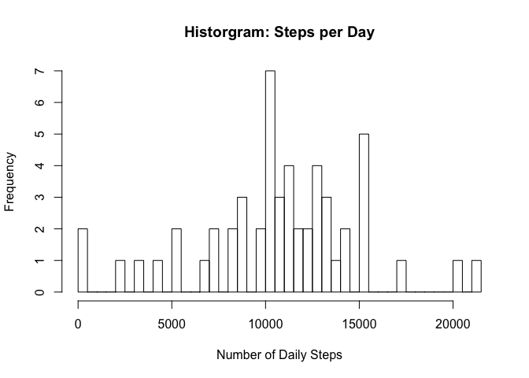
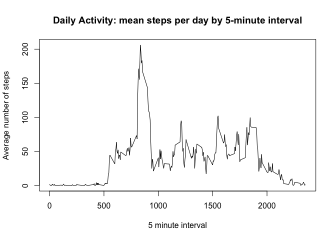
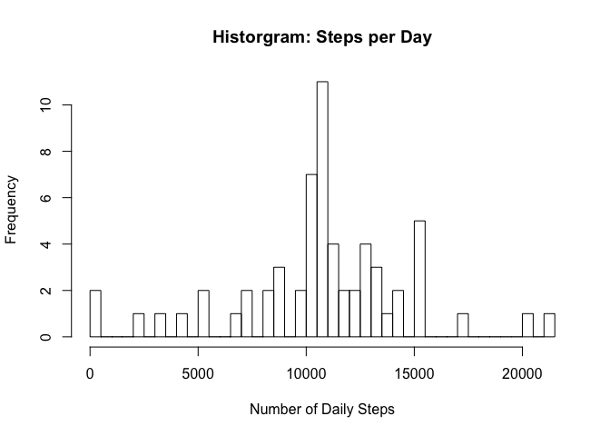
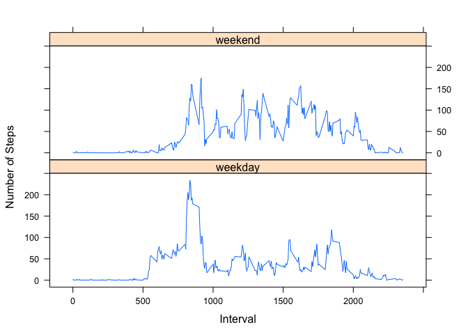

# Reproducible Research: Peer Assessment 1


## Loading and preprocessing the data
The first step will be to download the necessary data into R for analysis. The 
data consists of input from a volunteer wearing a personal activity device for 
a two month period.

the variables included in the data are as follows:

- **steps:** the number of steps taken in a 5-minute interval

- **date:** the date on which the measurement was taken (in YYYY-MM-DD format)

- **interval:** Identifier for the 5-minute interval in which measurement was taken


```r
activity<-read.csv("activity.csv")
```

There were a number of step data recorded as "NA" due to the fact that the 
volunteer was a circus clown, and he spent those days walking on his hands.

For the present, NA data was not removed.  However, the date data was in factor
format, and was therefore converted to date format for the sake of proper analysis


```r
activity$date<-as.POSIXct(activity$date)
```


## What is mean total number of steps taken per day?

to determine the number of steps taken per day, the sum of steps for each day was determined for the entire two-month period.

```r
dailysteps<-aggregate(steps~date,data=activity,FUN=sum)
```

When examining the frequency of steps per day, a histogram reveals that a large number of days cluster around the 10,000 steps mark.


```r
hist(dailysteps$steps,xlab="Number of Daily Steps",main="Historgram: Steps per Day",breaks=50)
```

 

This observation is supported by a review of the mean and median steps taken per day.


```r
print(c("Mean daily steps:",mean(dailysteps$steps)))
```

```
## [1] "Mean daily steps:" "10766.1886792453"
```

```r
print(c("Median daily steps:",median(dailysteps$steps)))
```

```
## [1] "Median daily steps:" "10765"
```


## What is the average daily activity pattern?

An examination of the average daily pattern of steps can be achieved by finding the mean number of steps per 5-minute interval over the two month period.

```r
average_steps_interval<-aggregate(steps~interval,data=activity,FUN=mean)
```

Plotting this data reveals that activity appears to peak at the 700-900 minute mark


```r
with(average_steps_interval,plot(interval,steps,type="l",ylab="Average number of steps",xlab="5 minute interval",main="Daily Activity: mean steps per day by 5-minute interval"))
```

 

which is confirmed by determining the interval with the highest average number of steps:


```r
average_steps_interval[average_steps_interval$steps==max(average_steps_interval$steps),]
```

```
##     interval    steps
## 104      835 206.1698
```

## Imputing missing values

As mentioned previously, the volunteers part-time work as a circus clown who walks around on his hands created gaps where no step data was collected.

In all, this resulted in 2,304 observations where no step data was recorded.


```r
colSums(is.na(activity))
```

```
##    steps     date interval 
##     2304        0        0
```

In an attempt to address whether or not missing data had an impact on the analysis,
a dataset was created in which NA datapoints were replaced by the mean steps 
for the 5-minute interval that was missing data.


```r
activityNA2Mean<-activity
for(i in seq_along(activityNA2Mean$steps)){
        if(is.na(activityNA2Mean$steps[i])){
                activityNA2Mean$steps[i]<-average_steps_interval[average_steps_interval$interval==activityNA2Mean$interval[i],2]
        }
}
```

a new histogram was then created to determine if there were any major differences
between the dataset with NA step observations and the one where NA observations
were replaced by the mean observations for that 5-minute interval

```r
dailystepsNA2Mean<-aggregate(steps~date,data=activityNA2Mean,FUN=sum)
```

```r
hist(dailystepsNA2Mean$steps,xlab="Number of Daily Steps",main="Historgram: Steps per Day",breaks=50)
```

 

While it appears to alter the dataset slightly, a review of the mean and median
steps per day reveals that replacing NA data with mean data at the 5-minute interval
level only appears to serve to force the observations to better fit the statistical measures.


```r
print(c("Mean daily steps:",mean(dailystepsNA2Mean$steps)))
```

```
## [1] "Mean daily steps:" "10766.1886792453"
```

```r
print(c("Median daily steps:",median(dailystepsNA2Mean$steps)))
```

```
## [1] "Median daily steps:" "10766.1886792453"
```


## Are there differences in activity patterns between weekdays and weekends?

In order to determine whether activity patterns differ on weekdays as compared
to weekends, a new variable was created **daytype** based on the day of the week each
observed day fell on.


```r
activity$daytype<-character(length=nrow(activity))
for(i in 1:nrow(activity)){
        activity$daytype[i]<-weekdays(activity$date[i])
        if(activity$daytype[i]%in%c("Saturday","Sunday")){
                activity$daytype[i]<-"weekend"
        }else{
                activity$daytype[i]<-"weekday"
        }
}

average_steps_interval_wkday<-aggregate(steps~interval+daytype,data=activity,FUN=mean)
```


when comparing average activity on weekdays vs. weekends, one observes noticable
differences between the two types:


```r
library(lattice)
xyplot(steps~interval|daytype,data=average_steps_interval_wkday,layout=c(1,2),type="l",
       ylab="Number of Steps",xlab="Interval")
```

 
